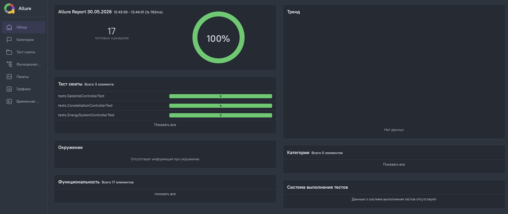
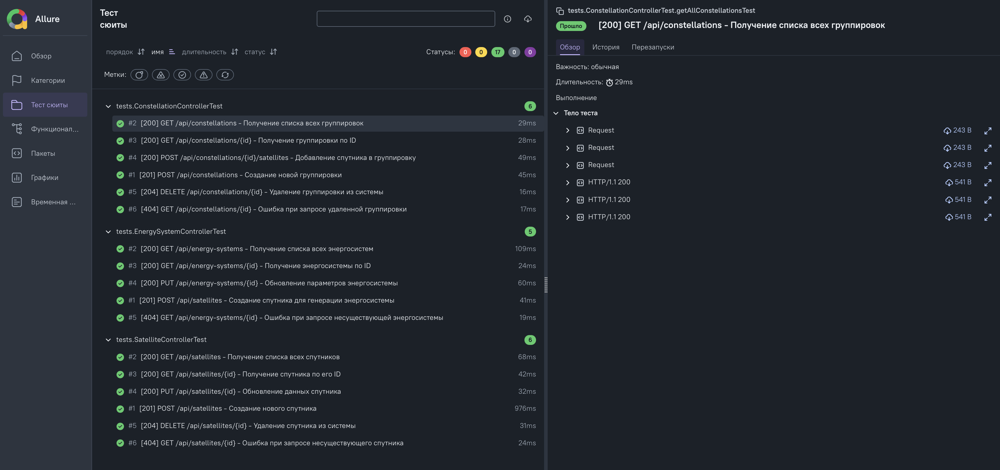

# Автотесты для бэкенда системы спутников

Проект предназначен для тестирования [системы управления спутниками](https://github.com/YatoroG/satellite-system-rest).

## Системные требования

- Java 21
- Maven
- Allure Report
- Docker

## Подготовка

Перед запуском автотестов необходимо убедиться, что контейнеры бэкенда запущены и доступны.

## Запуск автотестов

Для запуска:

1. Откройте терминал в папке проекта.
2. Введите команду для запуска тестов:
```bash
   mvn clean test
```
3. Введите команду для генерации allure-отчета:
```bash
   allure serve target/allure-results
```

## Отчет Allure

При запуске тестов ошибок в работе системы найдено не было, так как все было устранено еще при тестировании в Postman.

Если тест падал, то это было из-за неправильной настройки самого теста (возврат не того кода статуса или тела запроса),
а не из-за ошибок в бэкенде.



